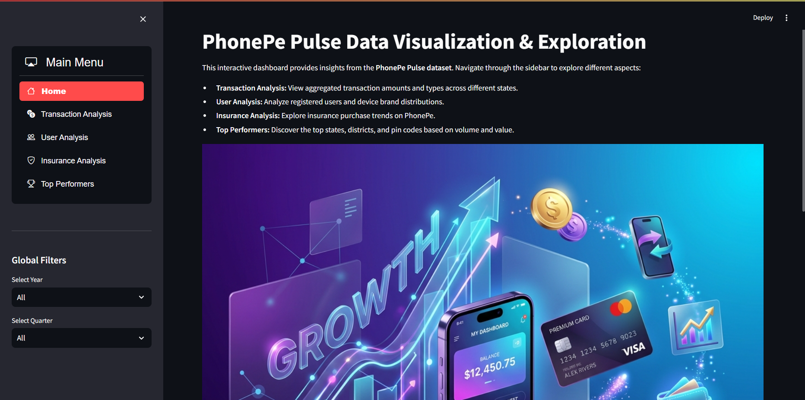
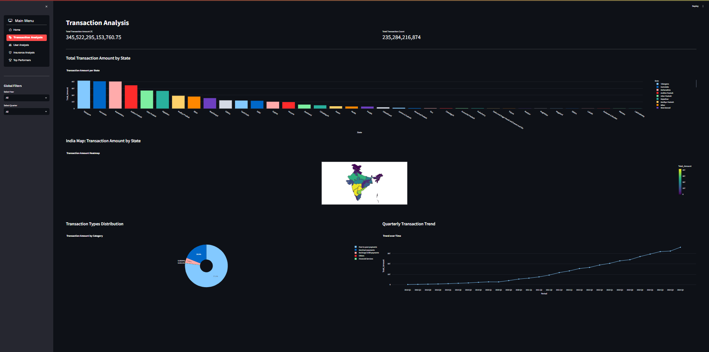
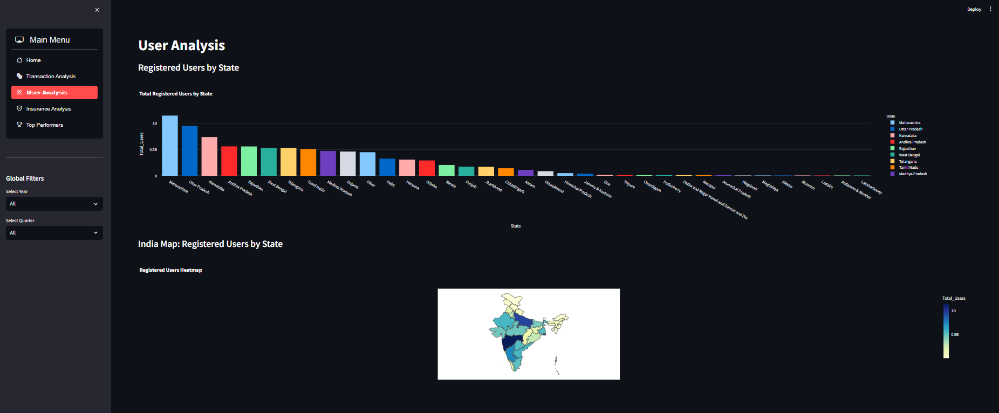
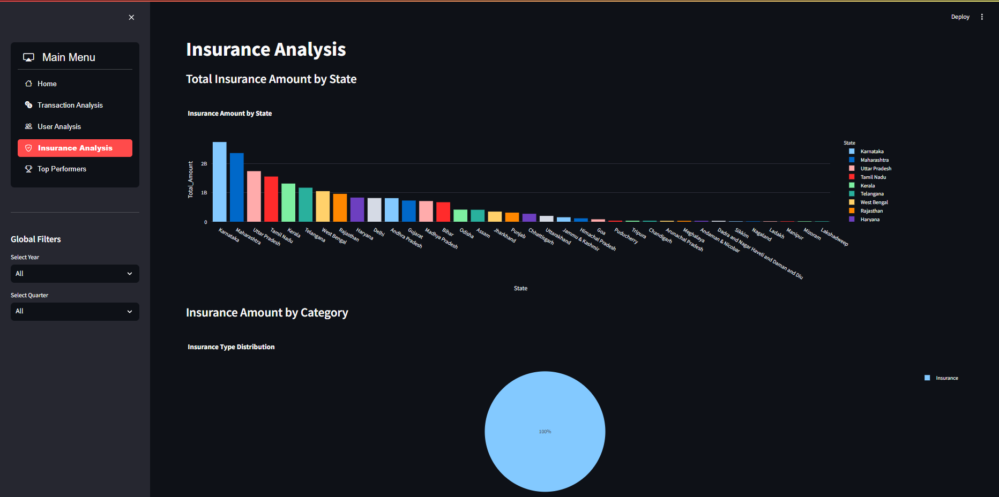
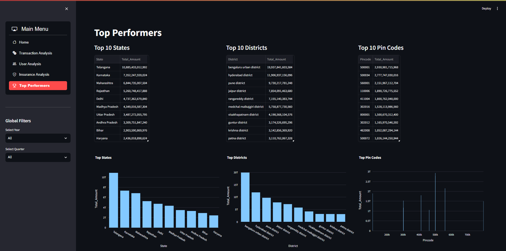

# PhonePe Pulse: Data Visualization & Exploration

[](https://www.python.org/)
[](https://streamlit.io/)
[](https://www.mysql.com/)

## 📝 Project Overview
This project is a comprehensive data science solution that extracts, processes, and visualizes data from the **PhonePe Pulse** GitHub repository. It automates the entire pipeline from raw JSON data extraction to interactive dashboard deployment, providing deep insights into India's digital payment landscape.

### Key Highlights:
- **End-to-End Pipeline:** Automated Extraction (ETL) -> Storage (MySQL) -> Analysis (EDA/ML) -> Visualization (Streamlit).
- **Relational Storage:** Data is structured into 9 normalized SQL tables for high-performance querying.
- **Advanced Analytics:** 20+ meaningful visualizations and predictive modeling for transaction trends.
- **Interactive Dashboard:** User-friendly interface with multi-dimensional filtering.

## 🚀 Dashboard Preview
Below are some highlights from the interactive Streamlit application:

| Home Page | Transaction Analysis |
| :---: | :---: |
|  |  |

| User Analysis | Insurance Analysis |
| :---: | :---: |
|  |  |

| Top Performers |
| :---: |
|  |

## 🛠️ Technologies Used
- **Logic:** Python
- **Data:** pandas, numpy, sqlalchemy
- **Visualization:** Plotly, Seaborn, Matplotlib
- **Database:** MySQL
- **ML:** scikit-learn, XGBoost
- **Frontend:** Streamlit

## 📁 Project Structure
```text
├── app.py                     # Streamlit dashboard entry point
├── EDA_Notebook.ipynb         # Detailed exploratory data analysis
├── ML_Notebook.ipynb          # Machine learning training pipeline
├── data_extraction.py         # ETL script for PhonePe JSON data
├── sql_schema.sql             # MySQL database schema definition
├── config.py                  # Database configuration (git-ignored)
├── requirements.txt           # List of Python dependencies
├── screenshots/               # Application preview images
└── README.md                  # Project documentation
```

## ⚙️ Setup & Installation

### 1. Database Configuration
1. Install MySQL Server and create a database named `phonepe_pulse`.
2. Execute the schema script:
   ```sql
   SOURCE sql_schema.sql;
   ```
3. Create a `config.py` file in the root directory (this is ignored by Git for security):
   ```python
   import urllib.parse
   DB_HOST = "localhost"
   DB_USER = "root"
   DB_PASSWORD = "your_password"
   DB_PASSWORD_ENCODED = urllib.parse.quote_plus(DB_PASSWORD)
   DB_NAME = "phonepe_pulse"
   ```

### 2. Environment Setup
```bash
# Install dependencies
pip install -r requirements.txt
```

### 3. Data Ingestion (ETL)
Run the extraction script to populate your database with the latest PhonePe Pulse data:
```bash
python data_extraction.py
```

### 4. Running the Application
```bash
# Launch the dashboard
streamlit run app.py
```

## 📊 Analytics Summary
- **EDA:** Uncovered regional growth patterns and dominant transaction types (P2P, Merchant).
- **ML:** Trained XGBoost and Random Forest models to predict transaction volumes with high accuracy (~0.97 R2).

## 🔗 Dataset Reference
- [PhonePe Pulse Data Repository](https://github.com/PhonePe/pulse)

---
*Developed by Farheen Fathima*
